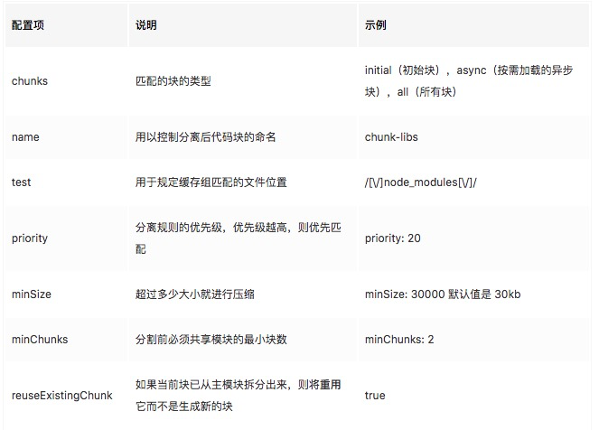

### code splitting

package.json 如下

```
{
  "scripts": {
    "dev": "webpack --mode development",
    "build": "webpack --mode production"
  },
  "devDependencies": {
    "clean-webpack-plugin": "^2.0.0",
    "webpack": "^4.29.6",
    "webpack-cli": "^3.2.3"
  },
  "dependencies": {
    "lodash": "^4.17.11"
  }
}
```

我们在 src/ 文件夹下创建 index.js 文件

```
import _ from 'lodash'

console.log(_.join(['a', 'b', 'c']))
```

> #### 配置 webpack.config.js 文件

```
const path = require('path')

const CleanWebpackPlugin = require('clean-webpack-plugin')

module.exports = {
  entry: {
    main: './src/index.js'
  },
  output: {
    publicPath: __dirname + '/dist/', // js 引用的路径或者 CDN 地址
    path: path.resolve(__dirname, 'dist'), // 打包文件的输出目录
    filename: '[name].bundle.js', // 代码打包后的文件名
    chunkFilename: '[name].js' // 代码拆分后的文件名
  },
  plugins: [new CleanWebpackPlugin()]
}
```

运行 npm run build 打包

在 index.html 中使用打包后的文件
```
<!DOCTYPE html>
<html lang="en">
  <head>
    <meta charset="UTF-8" />
    <meta name="viewport" content="width=device-width, initial-scale=1.0" />
    <meta http-equiv="X-UA-Compatible" content="ie=edge" />
    <title>代码分割</title>
  </head>

  <body>
    <script src="./dist/main.bundle.js"></script>
  </body>
</html>
```

使用浏览器打开 index.html 文件，进入控制台，可以看到如下信息：a,b,c

> #### 我们引用的第三方框架和我们的业务代码一起被打包，这样会有一个什么问题?

- 假设 lodash 为 1M，业务代码也为 1M，打包后假设为 2M
- 浏览器每次打开页面，都要先加载 2M 的文件，才能显示业务逻辑，这样会使得加载时间变长，
- 业务代码更新会比较频繁，第三方代码基本不会更改，这样重新打包后，假设为 2M，用户重新打开网页后，又会再加载 2M 文件
- 浏览器是有缓存的，如果文件没变动的话，就不用再去发送 http 请求，而是直接从缓存中取，这样在刷新页面或者第二次进入的时候可以加快网页加载的速度。

> #### 怎么解决呢，可以利用 webpack 中的代码分割

- 在 webpack4 之前是使用 commonsChunkPlugin 来拆分公共代码，v4 之后被废弃，并使用 splitChunksPlugins
- 在使用 splitChunksPlugins 之前，首先要知道 splitChunksPlugins 是 webpack 主模块中的一个细分模块，无需 npm 引入
现在我们来配置 webpack.config.js 文件

> #### 现在我们来配置 webpack.config.js 文件

```
const path = require('path')

const CleanWebpackPlugin = require('clean-webpack-plugin')

module.exports = {
  entry: {
    main: './src/index.js'
  },
  output: {
    publicPath: __dirname + '/dist/', // js 引用的路径或者 CDN 地址
    path: path.resolve(__dirname, 'dist'), // 打包文件的输出目录
    filename: '[name].bundle.js', // 代码打包后的文件名
    chunkFilename: '[name].js' // 代码拆分后的文件名
  },
  optimization: {
    splitChunks: {
      chunks: 'all'
    }
  },
  plugins: [new CleanWebpackPlugin()]
}
```

- 上面的代码段就是告诉 webpack，要做代码分割了，这里的 chunks: 'all' 是分割所有代码，包括同步代码和异步代码，webpack 默认是 chunks: 'async' 分割异步代码
- 我们使用 npm run dev 来打包开发环境下的代码，这样代码就不会压缩，方便我们来观察，可以看到代码被分割成两个文件了

> 打开 dist/main.bundle.js 文件，在最底部可以看到 src/index.js 文件，里面放的是业务逻辑的代码，但是并没有 lodash 的代码

> 打开 dist/vendors~main.js 文件，在最上面可以看到 lodash 模块

再次打开页面，控制台也输出了内容，这样就实现了 Code Splitting(代码分割)

其实没有 webpack 的时候，也是有代码分割的，不过是需要我们自己手动的分割，而现在使用了 webpack，
通过这种配置项的方式，它会自动帮我们去做代码分割

仔细看分割完的代码名称，vendors~main.js，我们对分割完的名称进行更改

还是在 splitChunks 的配置项中，添加 cacheGroups 对象

```
optimization: {
  splitChunks: {
    chunks: 'all',
    cacheGroups: {
      vendors: {
        name: 'vendors'
      }
    }
  }
}
```

再次打包就可以看到效果了，cacheGroups 的默认配置会定义 vendors 和 default

> 再次修改 webpack.config.js

```
splitChunks: {
    chunks: 'all',
    minSize: 30000,
    maxSize: 0,
    minChunks: 1,
    maxAsyncRequests: 5,
    maxInitialRequests: 3,
    automaticNameDelimiter: '~',
    name: true,
    cacheGroups: {
        vendors: {
            test: /[\\/]node_modules[\\/]/,
            priority: -10
        },
        default: {
            minChunks: 2,
            priority: -20,
            reuseExistingChunk: true
        }
    }
}
```

test: /[\\/]node_modules[\\/]/, 使用正则过滤，只有 node_modules 引入的第三方库会被分割

> 为了验证默认配置，我们将 splitChunks 属性设置为空对象，再次打包

修改配置如下

```
optimization: {
    // splitChunks: {
    //   chunks: 'all',
    //   cacheGroups: {
    //     vendors: {
    //       name: 'vendors'
    //     }
    //   }
    // }
}
```

> #### npm run dev 打包完发现只有一个文件，这是为什么?

因为 chunks 默认为 async，只会分割异步的代码，而之前我们写的都是同步的代码，先 import lodash，再去写业务逻辑，现在使用异步的方式来做，将 index.js 中的代码改为以下：

```
// import _ from 'lodash'
// console.log(_.join(['a', 'b', 'c']))

function getComponent(){
    //使用 异步代码 引入 lodash 
    return import('lodash').then( ( {default : _ }) => {
        var element = document.createElement('div');
        element.innerHTML = _.join(['hello','world'],'-');
        return element;
    });
}

getComponent().then(element => {
    document.body.appendChild(element);
})
```

运行 npm run dev    

```
这里分割出了 0.js 和 main.bundle.js，0 是以 id 为编号来命名
```

所以一般我们设置 chunks 为 all，异步、同步代码都打包

现在我们将 webpack 官网上的默认配置拷贝到我们的 webpack.config.js 中来分析一下

```
optimization: {
  splitChunks: {
    chunks: 'async',
    minSize: 30000,
    maxSize: 0,
    minChunks: 1,
    maxAsyncRequests: 5,
    maxInitialRequests: 3,
    automaticNameDelimiter: '~',
    name: true,
    cacheGroups: {
      vendors: {
        test: /[\\/]node_modules[\\/]/,
        priority: -10
      },
      default: {
        minChunks: 2,
        priority: -20,
        reuseExistingChunk: true
      }
    }
  }
}
```

webpack 代码分割的配置是这样的，比如我们要分割 jQuery 和 lodash 这样的第三方库，它会先经过 chunks、minSize、maxSize、minChunks 等等，满足条件后生成 jQuery 和 lodash 两个文件，然后放入 cacheGroup 中缓存着，再根据你在 cacheGroup 中配置的组来决定是将两个文件整合到一个文件打包，还是单独分开打包，比如上面代码中的 vendors，就是将 node_modules 中所有的第三方库都打包到 vendors.js 文件中，如果你还想继续分割可以这么做

```
cacheGroups: {
  lodash: {
    name: 'lodash',
    test: /[\\/]node_modules[\\/]lodash[\\/]/,
    priority: 5  // 优先级要大于 vendors 不然会被打包进 vendors
  },
  vendors: {
    test: /[\\/]node_modules[\\/]/,
    priority: -10
  },
  default: {
    minChunks: 2,
    priority: -20,
    reuseExistingChunk: true
  }
}
```

> 如果打包有报错 Support for the experimental syntax ‘dynamicImport’ isn't currently enabled，这是因为 dynamicImport 还是实验性的语法，webpack 不支持，需要安装插件来支持，具体步骤可以参考： https://www.cnblogs.com/chaoyueqi/p/9996369.html

再次打包，就可以看到 lodash 被分割出来了，以后使用第三方库都可以用这种配置来单独分割成一个 js 文件，比如 element-ui，注意设置 priority 的值很重要，优先级越高的会越先被打包


> 如果 index.js 引入了 A.js 和 B.js，同时 A、B 又引入了 common，common 被引入了两次，可以被称为公共模块

```
// a,js
import './common'
console.log('A')
export default 'A'

// b.js
import './common'
console.log('B')
export default 'B'

// common.js
console.log('公共模块')
export default 'common'

// index.js
import './a.js'
import './b.js'

// 异步代码
function getComponent() {
  // 使用异步的形式导入 lodash，default: _ 表示用 _ 代指 lodash
  return import('lodash').then(({ default: _ }) => {
    var element = document.createElement('div')
    element.innerHTML = _.join(['hello', 'world'], '-')
    return element
  })
}

getComponent().then(element => {
  document.body.appendChild(element)
})
```

上面那种异步的写法可能比较绕，现在精简一下，并且 webpack 对异步代码通过注释可以直接修改打包后的名称，以下代码全部以异步的形式引入

```
// 异步代码
import(/* webpackChunkName: 'a'*/ './a').then(function(a) {
  console.log(a)
})

import(/* webpackChunkName: 'b'*/ './b').then(function(b) {
  console.log(b)
})

import(/* webpackChunkName: 'use-lodash'*/ 'lodash').then(function(_) {
  console.log(_.join(['1', '2']))
})
```

将 minChunks 设置为 2，最小公用 2 次才分割

```
optimization: {
  splitChunks: {
    chunks: 'all',
    minSize: 30000,
    maxSize: 0,
    minChunks: 1,
    maxAsyncRequests: 5,
    maxInitialRequests: 3,
    automaticNameDelimiter: '~',
    name: true,
    cacheGroups: {
      lodash: {
        name: 'lodash',
        test: /[\\/]node_modules[\\/]lodash[\\/]/,
        priority: 10
      },
      commons: {
        name: 'commons',
        minSize: 0, //表示在压缩前的最小模块大小,默认值是 30kb
        minChunks: 2, // 最小公用次数
        priority: 5, // 优先级
        reuseExistingChunk: true // 公共模块必开启
      },
      vendors: {
        test: /[\\/]node_modules[\\/]/,
        priority: -10
      },
      default: {
        minChunks: 2,
        priority: -20,
        reuseExistingChunk: true
      }
    }
  }
}
```

这里分割出了 lodash 和我们在注释中定义的 use-lodash，前者是第三库，后者是使用第三库写的业务代码，也能被分割出来

> #### 打开index.html在浏览器 发现 

- 页面里只因入了 打包的入口文件
- 他会自动把我们分割的文件引入进来

这里之所以会自动引入分割后的依赖，可以查看打包后的 main.bundle.js 文件

- 会创建动态 script元素
- 异步引入的依赖名
- 拼接完整地址，这样浏览器就能找到对应的文件

常用的配置项在下面的表格中，更多配置详情见[官网](https://webpack.js.org/plugins/split-chunks-plugin/)



#### 参考文章

- [webpack4 系列教程 (三): 多页面解决方案 -- 提取公共代码](https://link.juejin.im/?target=https%3A%2F%2Fgodbmw.com%2Fpassages%2F2018-08-06-webpack-mutiple-pages%2F)
- [webpack 官网](https://webpack.js.org/plugins/split-chunks-plugin/#splitchunks-cachegroups-cachegroup-reuseexistingchunk)